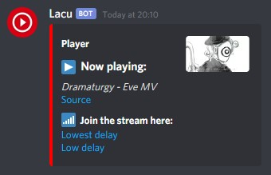
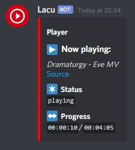

# Lacu
A bot for Discord similar to music bots, but with video support [on an external website](https://live.lacu.tk/).

# Getting Started
To get a list of all available commands, run the `<prefix> help` command.  
After starting a video using the `<prefix> play` command, 

# Screenshots
Below a few screenshots of the most important parts of Lacu.
## Web Player

## Play embed

## Status embed

# Dev Environment
1. Clone the repo
2. Install NodeJS 14.x
3. Install Yarn
4. Enter the directory using your favorite terminal
5. Run `yarn` to install all dependencies
6. You can now run `yarn run dev` to nodemon and automatically restart the script when a change has been made

# Authors
Migush
